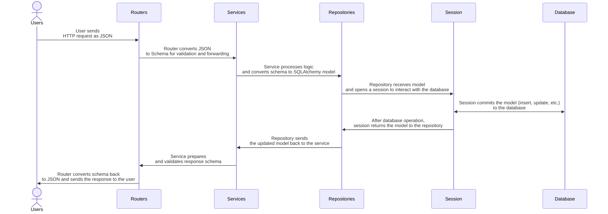

```mermaid
sequenceDiagram
    actor Users
    participant Routers
    participant Services
    participant Repositories
    participant Session
    participant Database

    Users->>Routers: User sends<br/>HTTP request as JSON
    Routers->>Services: Router converts JSON<br/>to Schema for validation and forwarding
    Services->>Repositories: Service processes logic<br/>and converts schema to SQLAlchemy model
    Repositories->>Session: Repository receives model<br/>and opens a session to interact with the database
    Session<<->>Database: Session commits the model (insert, update, etc.)<br/>to the database
    Session->>Repositories: After database operation,<br/>session returns the model to the repository
    Repositories->>Services: Repository sends<br/>the updated model back to the service
    Services->>Routers: Service prepares<br/>and validates response schema
    Routers->>Users: Router converts schema back<br/>to JSON and sends the response to the user
```
